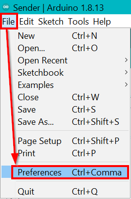
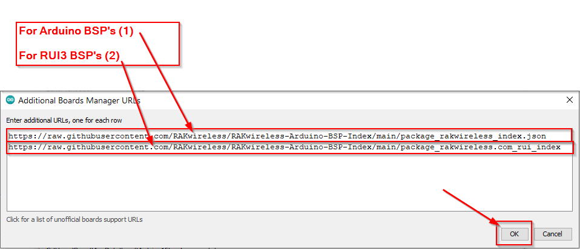
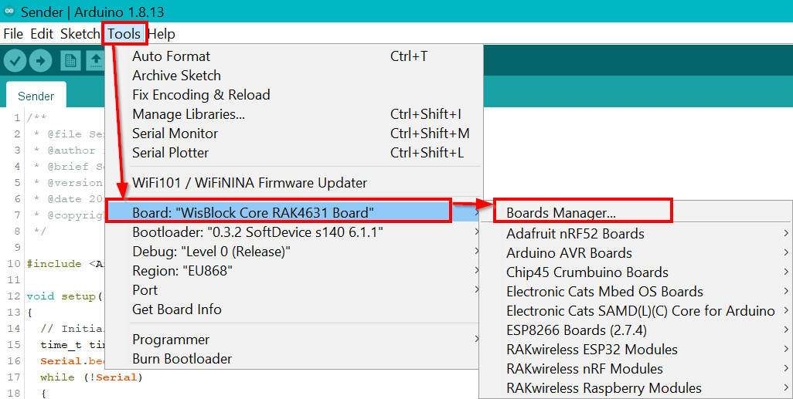
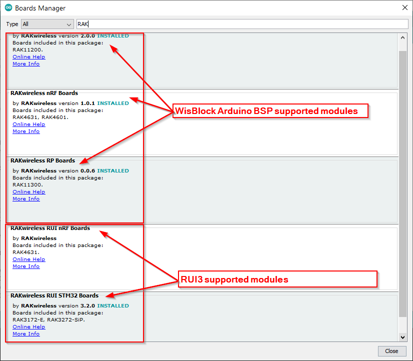
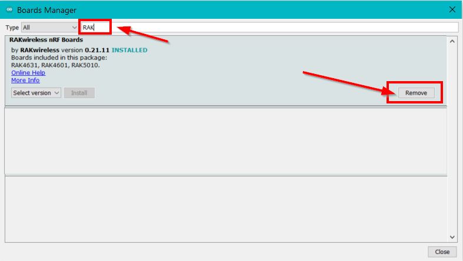
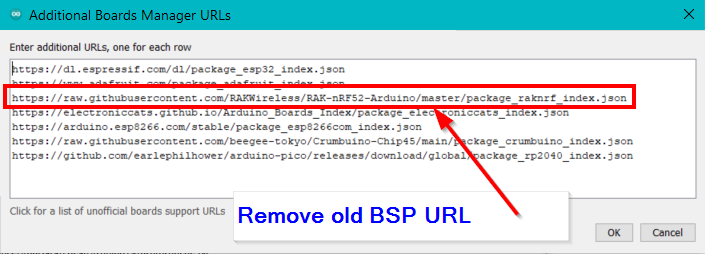

# RAKwireless BSP Support For The Arduino Board Manager
| 

 | 

 | 

 | 

 |
| :-: | :-: | :-: | :-: |

----

_**This repo contains the custom installation packages required by the Arduino IDE (version 1.6.4 or newer) to install the WisBlock Arduino BSP's and the RAKwireless RUI3 BSP's.**_

There are two installation packages available:
- `package_rakwireless_index.json` is for WisBlock Core module support in Arduino IDE v1.6.4 or newer.
- `package_rakwireless.com_rui_index.json` is for RUI3 support in Arduino IDE v1.6.4 or newer.

----

The difference between the two packages:
| Arduino BSP | 	RUI3 | 
| -- | -- | 
| Open Source | 	API is prorietary RAK code and not published | 
| Uses SX126x-Arduino library MAC stack V1.0.2 | 	Uses RAK MAC stack V1.0.3 | 
| Class A and C | 	Class A, B and C | 
| Has FreeRTOS (RAK4631/RAK11200) | 	Barebone SDK code | 
| lowest power consumption ~30uA (RAK4631) | 	lowest power consumption ~6uA | 
| Adopted from available open source BSP's | 	Developed by RAK R&D team | 
| Supports RAK4630, RAK4631, RAK11310 and RAK11200 | Supports RAK4630, RAK4631, RAK3172, RAK3172 EVB, RAK3272 Breakout Board, RAK3172-SiP, RAK3272-SiP Breakout Board |
| Uses open source bootloader | Uses RAK proprietary bootloader |

----

## Supported WisBlock Core modules for the Arduino BSP's

This repository contains support for the following RAKwireless Arduino BSP's for the following [WisBlock Core modules](https://docs.rakwireless.com/Product-Categories/WisBlock/#wisblock-core).

- **[RAK4631](https://docs.rakwireless.com/Product-Categories/WisBlock/RAK4631/Overview/)**    
- **[RAK11200](https://docs.rakwireless.com/Product-Categories/WisBlock/RAK11200/Overview/)**
- **[RAK11310](https://docs.rakwireless.com/Product-Categories/WisBlock/RAK11310/Overview/)**

## Supported RUI3 modules

This repository contains RUI3 support for the following RAKwireless modules.

- **[RAK4630](https://docs.rakwireless.com/Product-Categories/WisDuo/RAK4630-Module/Overview/)**    
- **[RAK4631-R](https://docs.rakwireless.com/Product-Categories/WisBlock/RAK4631-R/Overview/)**    
- **[RAK3172](https://docs.rakwireless.com/Product-Categories/WisDuo/RAK3172-Module/Overview/)**
- **[RAK3172-SiP](https://docs.rakwireless.com/Product-Categories/WisDuo/RAK3172-SiP/Overview/)**
- **[RAK3272S Breakout Board](https://docs.rakwireless.com/Product-Categories/WisDuo/RAK3272S-Breakout-Board/Overview/)**
- **[RAK3272-SiP Breakout Board](https://docs.rakwireless.com/Product-Categories/WisDuo/RAK3272-SiP-Breakout-Board/Overview/)**
- **[RAK3172 Evaluation Board](https://docs.rakwireless.com/Product-Categories/WisDuo/RAK3172-Evaluation-Board/Overview/)**

----

## Installation instructions for _RAKwireless WisBlock Core_ modules

To add board support for our products, start Arduino and open the Preferences window (**File** > **Preferences**).     

     

----

In the **Preferences** window, look for **Additional Boards Manager URLs** and click the icon on the right side.

  

----
----

### If installing Arduino BSP's for WisBlock
Copy `https://raw.githubusercontent.com/RAKwireless/RAKwireless-Arduino-BSP-Index/main/package_rakwireless_index.json` and paste it into the new window.      
- If there is already an URL from another manufacturer in that field, paste the above URL into a new line.    

### If installing RUI3 BSP's
Copy `https://raw.githubusercontent.com/RAKwireless/RAKwireless-Arduino-BSP-Index/main/package_rakwireless.com_rui_index` and paste it into the new window.      
- If there is already an URL from another manufacturer in that field, paste the above URL into a new line.    

  

Then press the **OK** button.

----

Next open the **Boards Manager** in the menu **Tools**    
 

----

Write "RAK" (without quotes) in the search bar. The RAKwireless WisBlock Core modules and/or the RAKwireless RUI3 supported modules will be shown in the window.  
  
 

You can see which BSP is required for which WisBlock Core module.     
Select the BSP you need for your WisBlock Core module or RUI3 supported module and click on **Install**.    

_**Depending on your connection speed, the installation can take some time. Please be patient.**_

----

**RAKwireless invests time and resources providing this open source code, please support RAKwireless and open-source hardware by purchasing products from [RAKwireless](https://rakwireless.com)!**

**_For support and questions about RAKwireless products please visit our [forum](https://forum.rakwireless.com/)    
For examples and quick start tutorial please visit our [Github Repo](https://github.com/RAKWireless/Wisblock)    
For documentation about RUI3 API visit [Documentation Center - RUI3](https://docs.rakwireless.com/RUI3/)    
For additional information about RAK products please visit our [Documentation Center](https://docs.rakwireless.com/Product-Categories/WisBlock/)    
To buy WisBlock modules please visit our [online store](https://store.rakwireless.com/pages/wisblock)_**

<!--
# Uninstall Old BSP Package
If you have installed the RAKwireless nRF Modules BSP before, you need to uninstall them first, otherwise you will have the boards listed twice!  
  
## Uninstall the RAKwireless nRF Modules BSP
Open the **Boards Manager** in the menu **Tools**    
 

----

Write "RAK" (without quotes) in the search bar. The already installed RAKwireless WisBlock Core modules will be shown in the window.  
  
 

Select the existing RAK nRF BSP and click on **REMOVE**.    

----

## Remove BSP URL from preferences
To remove the old BSP URL open the Preferences window (**File** > **Preferences**).     

     

----

In the **Preferences** window, look for **Additional Boards Manager URLs** and click the icon on the right side.

  

Look for the old entry     
**`https://raw.githubusercontent.com/RAKWireless/RAK-nRF52-Arduino/master/package_raknrf_index.json`**    
and remove the line.  
  
  

Now you can [continue](#continue) with the new BSP installation.
-->